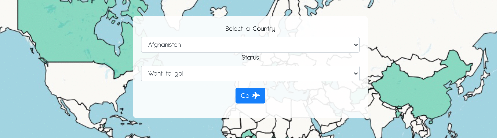

  # Around the World

  

  ## Table of Contents
  * [Description](#description)
  * [Installation](#installation)
  * [Usage](#usage)
  * [Contributing](#contributing)
  * [Questions](#questions)
  * [License](#license)

  ## Description
  Around the World is a site to track the countries you've been and want to go to. Each user's selected countries are stored in a Postgres database and displayed with a choropleth map. The site was built with a Django python framework. The world map that displays the user's countries utilizes the folium package and its choropleth method. To create the custom background gif a jupyter notebook uses folium to incrementally add countries and write files for each image. The command line tool ImageMagick compiled all the created files into a single gif. 
  ## Installation
  A requirements.txt file is included with all the necessary dependencies
  ## Usage
  Try mapping the countries you've been to with the following link. Simply create an account or sign in and start adding countries. 
  
  [Around the World](https://go-around-the-world.herokuapp.com/)
  ## Contributing
  Django was used as the web framework, Postgres for the database, Folium for data visualization, Pandas for wrangling data, and ImageMagick for creating the background gif. 

  ## Questions
  Github profile: [dgtlctzn](https://github.com/dgtlctzn)
  
  If you have any questions about the project please contact josephperry720@gmail.com
  ## License
  This project is covered under the GNU license
